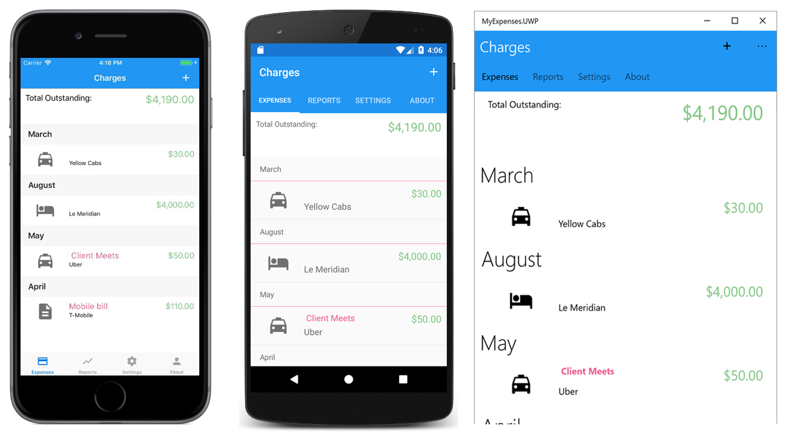
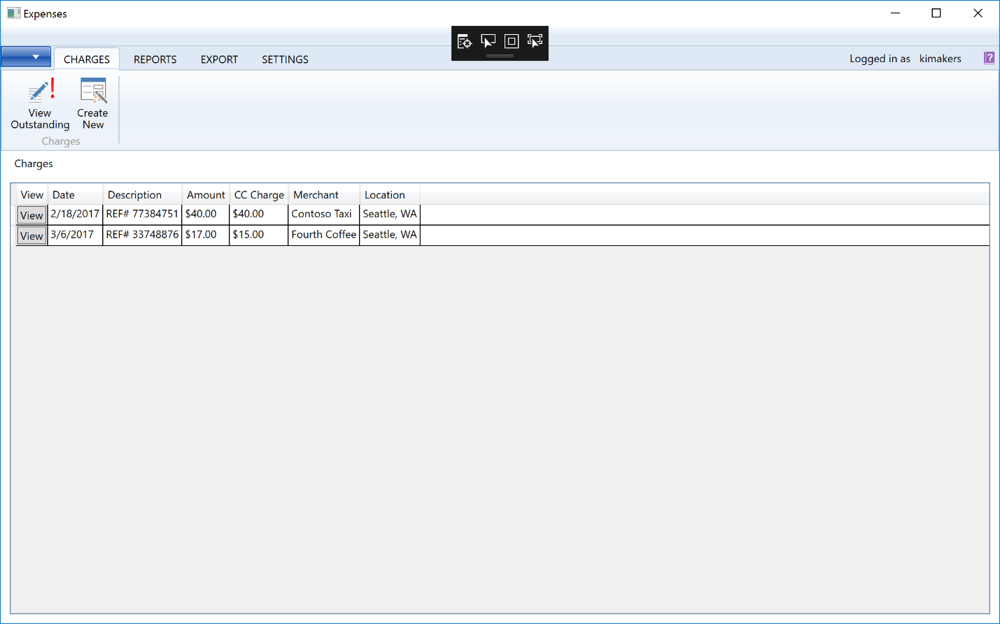

# WPFToMobile
A sample WPF app that is ported to iOS, Android &amp; UWP using Xamarin.Forms. Read my [blog post](https://blogs.msdn.microsoft.com/visualstudio/2018/04/16/mobilizing-existing-net-apps/) for details.

### Mobile App

### WPF App

